# 2025年你必须了解的15款顶级AI实时监控摄像头系统

在数字化时代,家庭和商业安全面临着前所未有的挑战。传统摄像头只能被动记录,无法主动预防犯罪。本文精选15款配备AI智能分析和实时响应能力的安防监控系统,帮助您在入侵发生前就能有效制止威胁,节省80%的虚假警报处理时间。无论是保护住宅安全还是商业资产,这些系统都能提供24/7全天候保护,支持2K至4K超清画质,并在30秒内联系执法部门。

## **[Deep Sentinel](https://deepsentinel.com)**

AI驱动的实时安保监控系统,配备真人安保团队主动干预

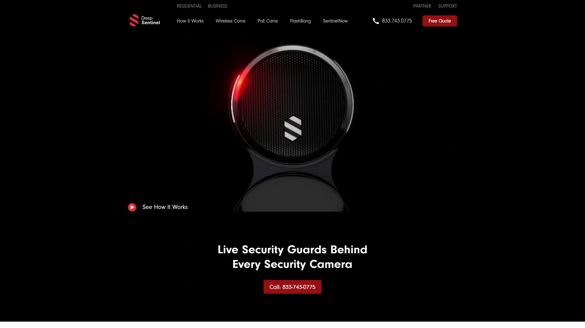

Deep Sentinel通过结合本地AI分析和24/7真人安保监控,重新定义了家庭和商业安防标准。系统采用本地AI中枢以每秒50帧的速度处理视频流,在检测到潜在威胁时立即通知专业安保人员。安保团队可通过摄像头的双向音频直接与入侵者对话,触发警报,并在30秒内联系当地警方,这是所有安防系统中最快的警方响应速度。

提供无线和PoE两种摄像头选择,无线版本适合住宅和中小型商铺,支持30分钟DIY安装。PoE版本提供2K和4K视频质量,专为仓库、建筑工地、汽车经销商等大型商业场所设计。独特的FlashBang反入侵系统集成了辣椒喷雾、烟雾弹、警报器和频闪灯,为面对严重威胁的用户提供最强防御。

系统起价499美元,配备移动应用可实时查看安保团队监控画面、审查完整事件历史、随时使用双向音频功能。用户完全掌控隐私设置,可一键控制安保团队的访问权限。适用于美国所有50个州的住宅和商业物业。

## **[ADT Security](https://www.adt.com)**

拥有140年历史的专业监控领导品牌,提供全天候警报中心服务

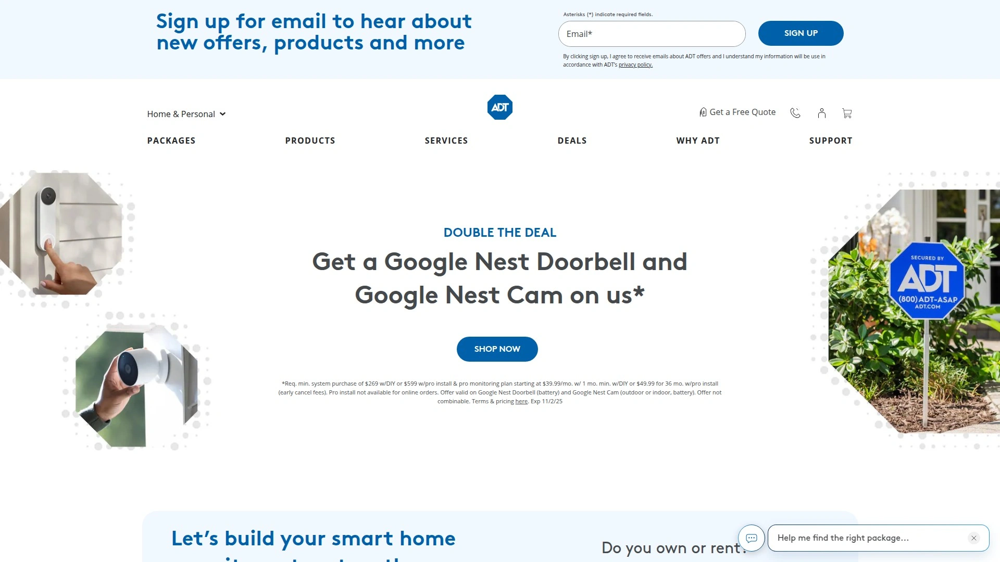

ADT凭借其140年的行业经验和六个24/7监控中心,成为美国最受信赖的专业安防品牌。系统集成了入侵、火灾和一氧化碳检测功能,当警报触发时,专业监控人员会确认危险并联系911。与Google Nest摄像头的深度整合使ADT系统能够提供智能家居和安防的完美结合。

监控服务支持DIY和专业安装两种方式,无需长期合约,提供1年质保。系统可根据家庭需求定制,随时添加更多设备扩展功能。Nest Cam集成提供高清范围视频,在明亮阳光和低光环境下都能清晰显示细节,内置双向通话功能可远程与家人或宠物沟通。

视频采用加密传输,通过Google账户的两步验证增强安全性,摄像头处理或传输视频时绿色LED指示灯会亮起保护隐私。专业监控服务确保在入侵期间快速响应,帮助保护家庭成员安全。

## **[Vivint Smart Home](https://www.vivint.com)**

智能家居安防专家,提供触摸屏控制面板和第三方设备无缝集成

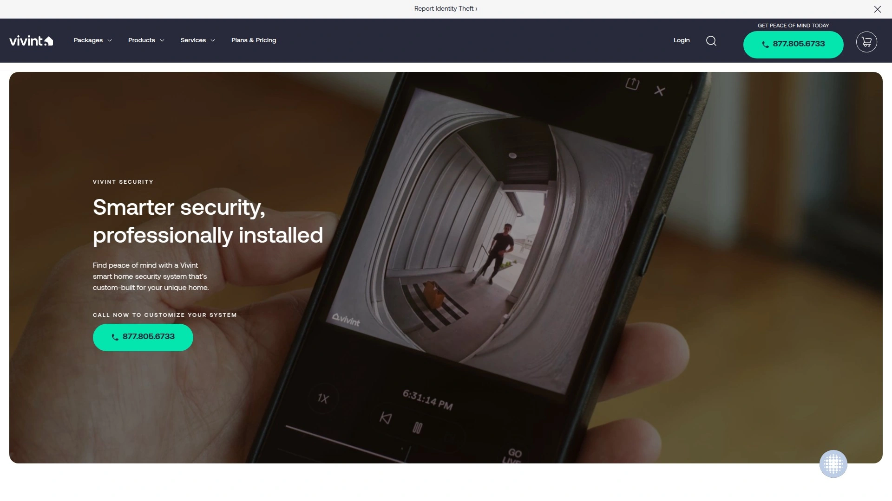

Vivint以高度精致的用户体验和广泛的第三方设备集成能力脱颖而出。系统核心是触摸屏控制面板,配备多个传感器,无需长期合约即可开始使用。与Google Assistant和Alexa的原生集成使语音控制变得简单,同时支持大量Vivint自有和第三方智能设备。

摄像头加载速度比许多竞品更快,连接更稳定,这主要得益于室内Wi-Fi桥接器的设计。专业安装服务确保系统配置正确,48个月的服务周期为长期用户提供稳定保障。系统在SafeHome测试中获得9.1的高分,被评为"智能安防首选"。

适合希望构建模块化安防系统并随时间扩展的家庭用户。摄像头、门窗传感器、运动探测器和智能锁可根据实际需求灵活组合,支持从小型公寓到大型住宅的各种场景。

## **[SimpliSafe](https://www.simplisafe.com)**

DIY安装领先品牌,配备入侵者干预技术和灵活监控方案

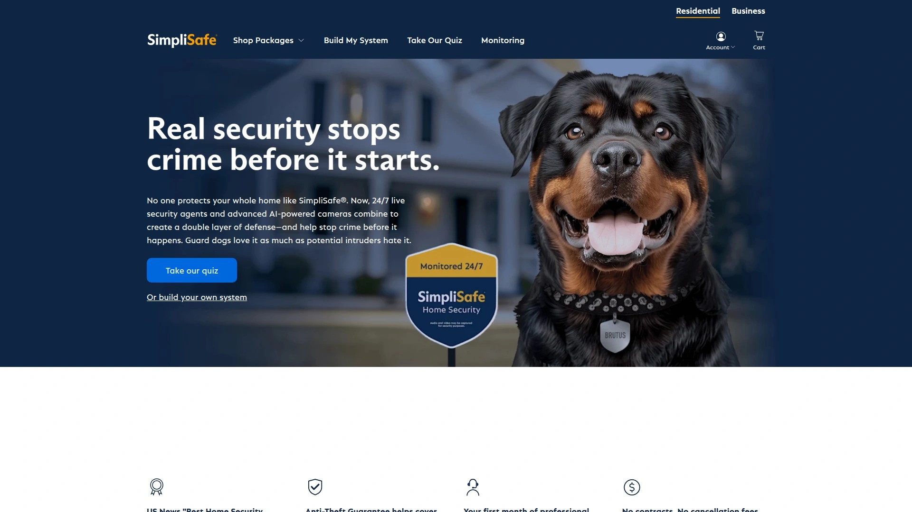

SimpliSafe在2025年以其易用性和全面功能获得最佳家庭安防摄像头的第一名。系统起价250美元(常有折扣),提供完整的电池供电运动传感器阵列,所有设备在测试中表现卓越。最新的AI面部和动作检测功能帮助监控人员更准确地识别威胁。

用户可选择自助监控或专业监控,基础监控每月10美元起,推荐的24/7专业监控服务每月30美元,包含家庭监控、即时应用警报和加快响应时间。DIY安装无需专业知识,避免了复杂的Wi-Fi和智能家居集成。在SecureScore评分中获得9.2分,排名第二,仅次于ADT。

兼容Alexa和Google Assistant语音助手,频繁的促销活动使首次购买用户可享受高达50%的折扣。设备质保1年,无需签订长期合约,为追求灵活性的用户提供理想选择。

## **[Ring Alarm](https://ring.com)**

亚马逊旗下智能安防品牌,提供经济实惠的自助安装方案

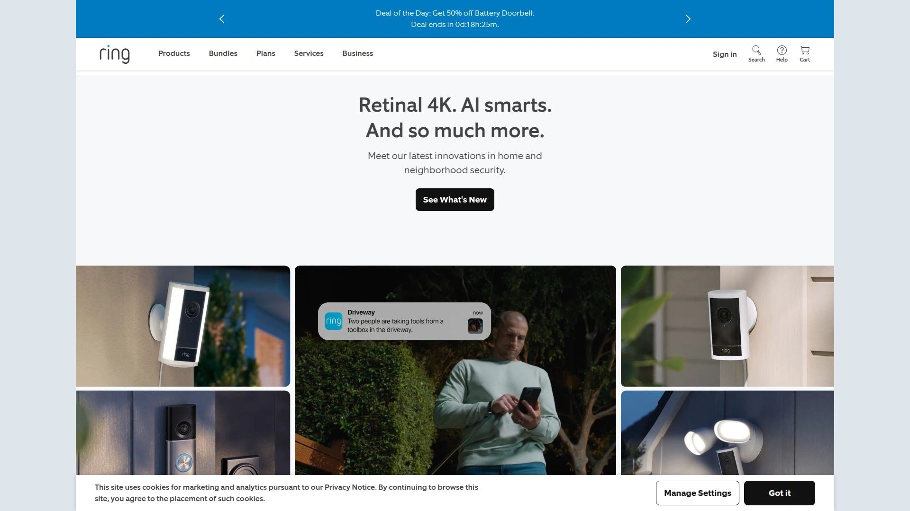

Ring Alarm在过去两年中推出了两款表现优异且易用的DIY安防系统:Ring Alarm Pro和标准Ring Alarm。系统无需合约,订阅计划价格合理,使其成为预算购买者的首选。在SafeHome评分中获得8.2的SecureScore,提供自助或专业监控两种选择。

摄像头产品线包括室内外摄像头、视频门铃和泛光灯摄像头,所有设备与Ring生态系统无缝集成。视频门铃在市场上享有很高的知名度,提供运动检测、双向通话和移动警报功能。室外摄像头支持1080p至2K分辨率,配备夜视和运动激活录制功能。

云存储方面,订阅服务每月约3美元起,提供30至60天的视频历史记录。系统支持DIY或专业安装,设备质保1年。与Alexa的深度集成允许用户通过语音命令查看摄像头画面和控制系统。

## **[Arlo](https://www.arlo.com)**

无线安防摄像头专家,提供电池和太阳能供电选项

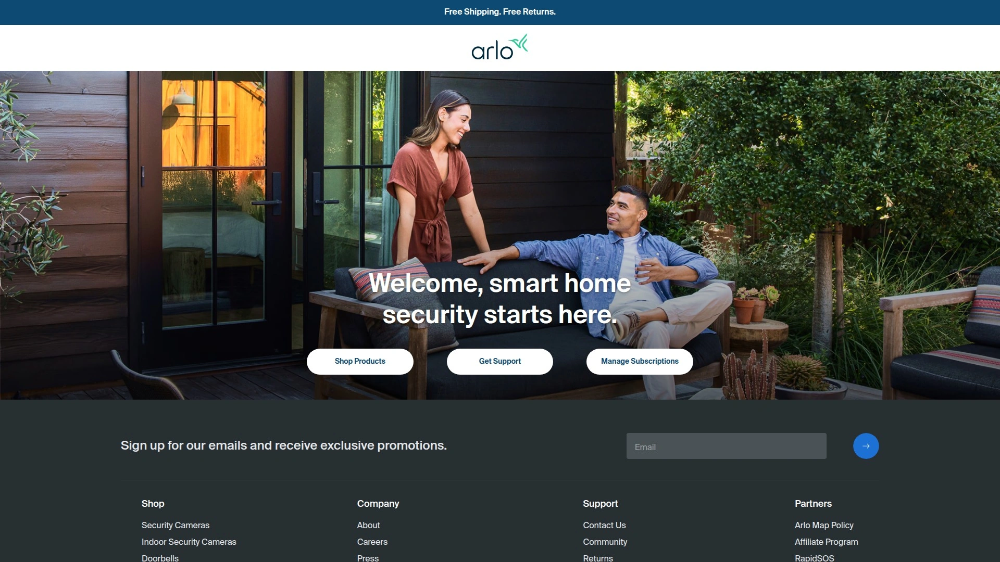

Arlo专注于无线安防摄像头技术,提供从入门级到专业级的多种型号。Essential XL第二代以出色的电池续航和丰富功能在相对实惠的价格点上脱颖而出。Go 2 LTE/Wi-Fi型号支持移动网络连接,适合无Wi-Fi覆盖的偏远位置。

Pro 5S系列提供2K聚光灯摄像头,三件套在促销期间可节省170美元。EufyCam 3 S330配备双镜头设计、3K分辨率、彩色夜视和机械云台,支持电池和太阳能供电。所有Arlo摄像头提供本地和云存储选项,高级型号包含内置聚光灯和警报器。

系统与Amazon Alexa、Google Assistant和Apple HomeKit兼容,部分型号支持IFTTT自动化。在多个评测中获得高分,被列为2025年最佳智能家居安防系统之一。适合需要完全无线解决方案的用户,无需布线即可快速部署。

## **[Eufy Security](https://www.eufy.com)**

本地存储专家,无订阅费用即可享受完整功能

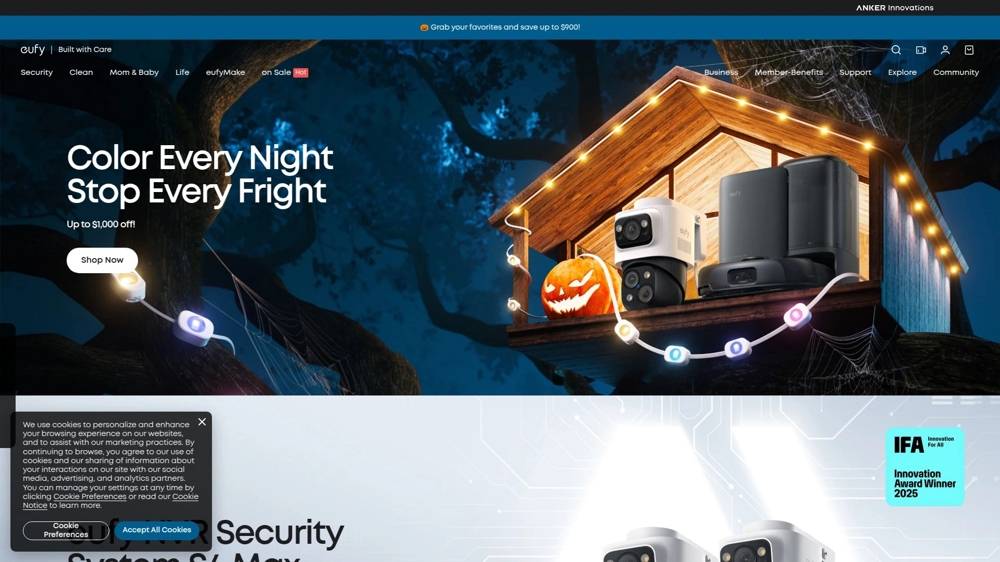

Eufy以其无订阅费用的本地存储方案在行业中独树一帜。SoloCam S340无线室外摄像头配备本地视频存储,无需月费即可保存录像。系统支持4K清晰度、AI检测和智能集成,为用户提供专业级安防体验。

EufyCam 3系列提供电池供电和太阳能选项,适合长期部署。设备支持人物、宠物和车辆识别,大幅减少误报。在Reddit讨论中,Aqara和Eufy被认为是2025年最均衡的DIY系统选择,尽管摄像头产品线相对较弱。

专业监控服务可选,提供24/7家庭安全保护,30天退货政策为用户提供无风险试用。系统兼容主流智能家居平台,通过移动应用可远程访问实时视频和录像。适合希望避免订阅费用但仍需专业级功能的用户。

## **[Google Nest Cam](https://store.google.com)**

Google智能生态整合方案,提供加密视频和智能检测

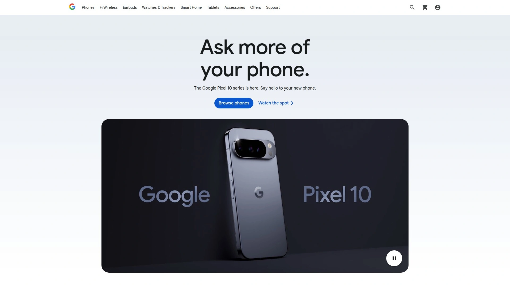

Google Nest Cam系列包括室内有线、室内外电池供电等多款型号,全面覆盖各类安装场景。最新的室外有线第二代提供2K HDR视频,配备Gemini AI增强的智能检测能力。摄像头使用加密视频传输,通过Google账户的两步验证和增强安全功能保护隐私。

电池版本提供135°对角视野,有效覆盖大面积空间,消除监控盲区。设备内机器学习能够准确区分人类和其他运动触发源,显著减少宠物、阴影或环境因素造成的误报。1080p 30fps的HDR视频配备双高功率红外LED,夜视距离达15英尺。

免费套餐包含3小时事件视频历史,Nest Aware订阅每月6美元提供30天历史,Nest Aware Plus每月12美元提供60天事件历史加10天24/7录制。与Google Home生态完美集成,支持通过Google Assistant语音控制。绿色LED指示灯在摄像头处理或传输视频时亮起,确保隐私透明。

## **[Reolink](https://reolink.com)**

4K超清画质专家,提供先进云台和本地存储

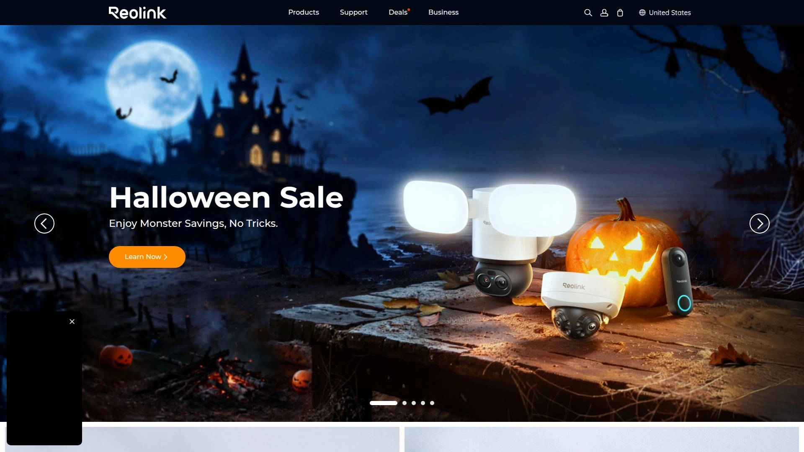

Reolink Altas PT Ultra代表了消费级4K安防摄像头的顶级水平。系统提供本地存储选项,无需订阅即可录制和回放视频。设备支持宽角镜头和夜视功能,SSD存储确保数据安全可靠。

在与Lorex的比较中,Reolink更适合房主和DIY爱好者,提供更友好的价格和易用性。Altas PT Ultra配备机械云台功能,可远程控制摄像头角度,扩大监控范围。系统兼容多种平台,支持室内外部署。

用户反馈显示Reolink在画质、稳定性和性价比方面表现优异。适合需要高分辨率录像和灵活存储方案的技术爱好者。

## **[Lorex](https://www.lorex.com)**

专业级商用系统,支持大规模多摄像头部署

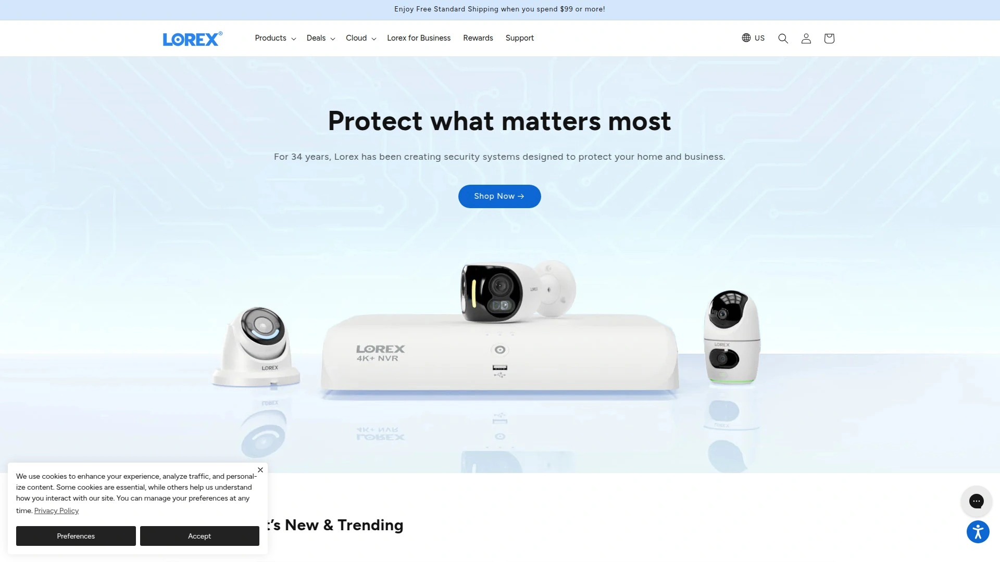

Lorex专注于专业级安防系统,特别擅长商业应用场景。在应用可用性和多功能性方面优于Swann,提供4K视频和自定义录制选项。系统支持4至24个摄像头的配置,适合从小型商铺到大型仓库的各种规模。

PoE(以太网供电)系统提供更快的数据传输和更稳定的电源供应。在Reddit讨论中,用户提到其叔叔在商业场所使用Lorex系统并非常满意。与Hikvision相比,Lorex在价格上更亲民,基础型号价格更低。

专业安装确保系统配置正确,支持NVR(网络视频录像机)集成。适合需要可靠商业级性能但预算有限的中小企业。

## **[Blink](https://blinkforhome.com)**

亚马逊旗下超长续航摄像头,电池可用长达2年

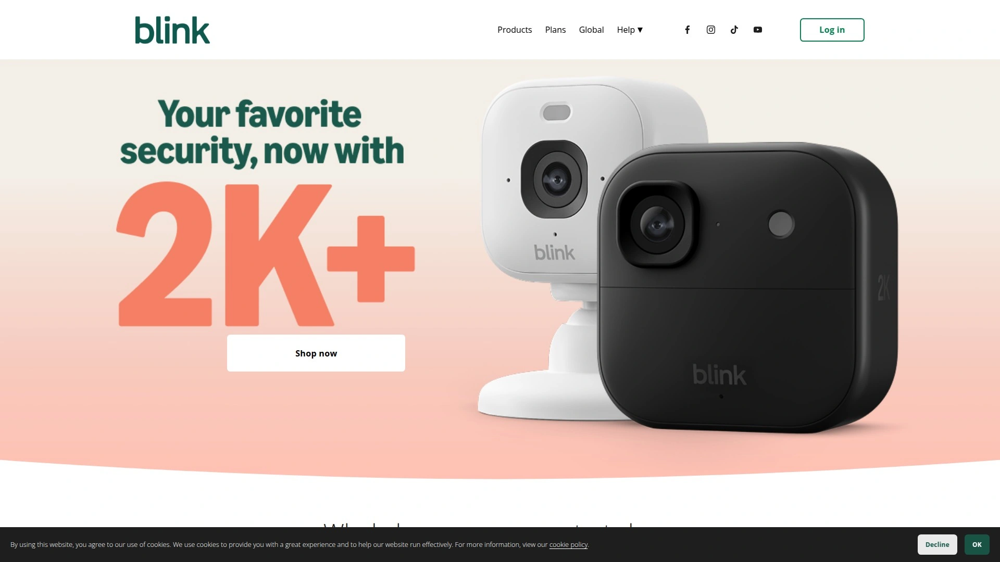

Blink以其超长电池续航能力著称,Outdoor 4在最低画质设置下可使用长达2年。三件套促销价99.99美元,节省160美元,是预算有限用户的理想选择。系统提供1080p分辨率、本地存储选项和1年有限质保。

Blink Mini和Outdoor 4都支持运动检测、双向音频和移动警报。云存储服务每月约3美元起,提供30至60天视频历史。设备仅与Amazon Alexa集成,不支持Google Home。

虽然画质和音质不如Wyze,但Blink的"设置后忘记"特性使其适合基本监控需求。分辨率和帧率可调节,尽管这种调节不如固定高质量输出实用。适合需要低维护、长续航室外摄像头的用户。

## **[Wyze](https://wyze.com)**

高性价比智能摄像头,提供免费14天云存储

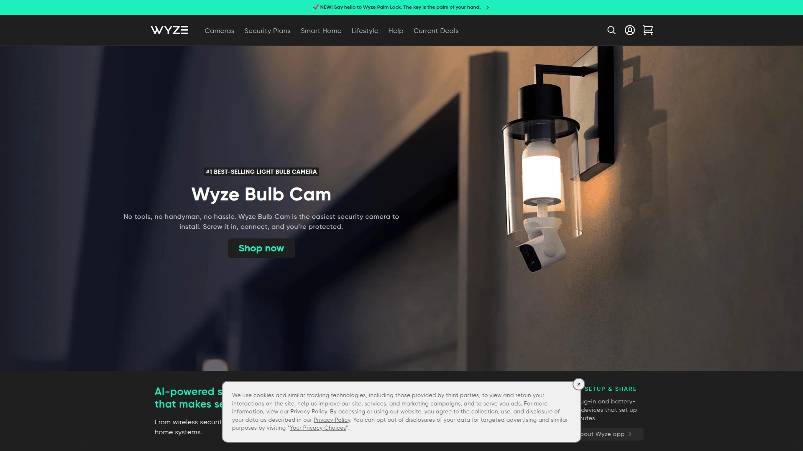

Wyze在预算友好型摄像头市场中以卓越的性价比和丰富功能领先。Cam v4提供1440p分辨率,明显优于Blink的1080p,在室内外测试中画质和音质都表现更佳。系统提供免费14天云存储,这是同价位产品中极为罕见的优势。

与Amazon Alexa和Google Home双平台兼容,灵活性超过仅支持Alexa的Blink。Wyze还提供安防系统产品,摄像头可与其他安防设备无缝协作。Cam v3系列在40美元以下价位提供出色的夜视和彩色成像能力。

视野范围比Blink更宽,但Cam Outdoor的电池续航最长仅6个月,不及Blink的2年。在SafeWise的全面测试中,Wyze在画质、音质、设置便捷性和通知频率等各方面都优于Blink。适合预算有限但不愿在功能上妥协的用户。

## **[ECAM](https://ecam.com)**

商业级实时视频监控,融合AI技术和人工专业判断

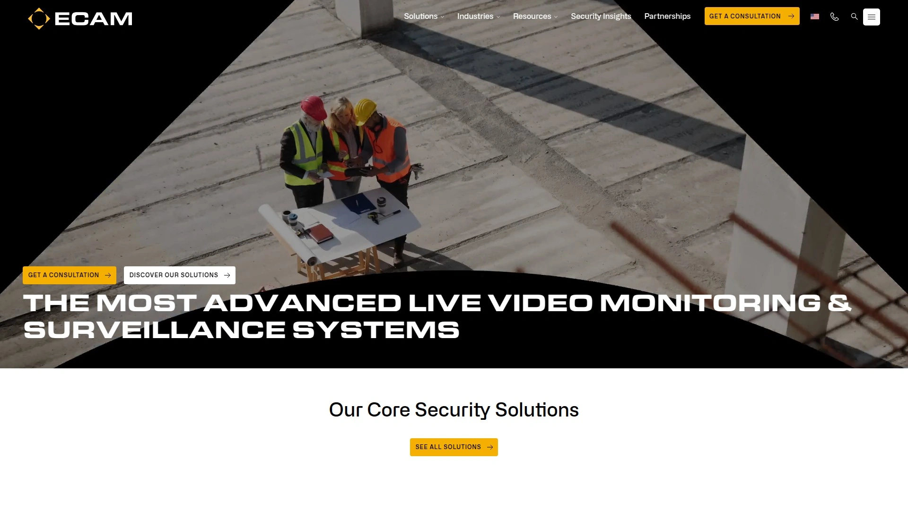

ECAM专注于商业安防,提供融合AI技术和人工专业判断的实时视频监控解决方案。系统整合永久性和移动监控单元(MSU),为各种商业场景提供灵活覆盖。移动监控单元采用太阳能供电,利用云技术实现快速部署,无需本地电源和网络基础设施。

AI检测能力在行业中处于领先地位,结合人工实时审查,避免AI单独工作可能遗漏的事件。系统集成车牌识别(LPR)功能和可搜索数据库,提供实时报告、分析和视频访问。适用于建筑工地、汽车经销商、能源和关键基础设施等多个行业。

与竞品相比,ECAM同时提供永久和移动解决方案,而大多数竞争对手只专注其中一种。可快速定制以解决行业特定问题,部署速度快于需要本地设施的传统系统。证明的犯罪威慑能力帮助企业减少盗窃、破坏和责任风险。

## **[Avigilon](https://www.avigilon.com)**

企业级AI安防平台,提供异常行为检测和面部识别

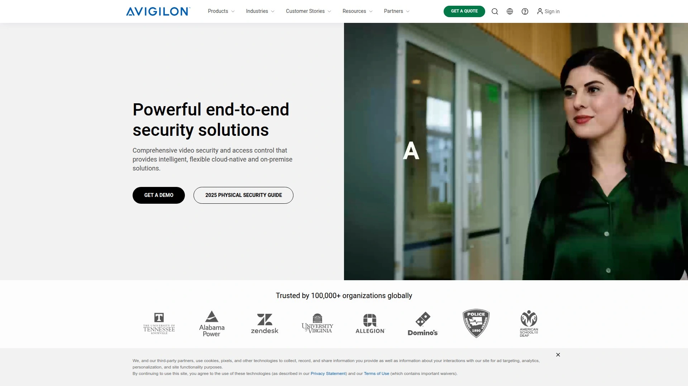

Avigilon是Motorola Solutions旗下的企业级AI安防摄像头品牌,利用机器学习算法实时分析和解释场景。系统基于预设规则(如车辆逆向行驶)或从场景中学习的模式识别异常活动。当AI检测到偏离常态的活动时,立即向视频管理系统(VMS)发送警报供操作员处理。

核心能力包括物体检测(区分人类、动物和车辆)、面部识别(匹配数据库中的记录)、异常活动标记(不寻常的运动、物体位置或速度)。AI摄像头帮助安保团队更准确检测真实威胁而非误报,减轻人员负担并节省资源。系统可与门禁控制、警报和无线电通信集成,增强态势感知和响应能力。

学校安防摄像头部署中发挥关键作用,确保校园环境安全。AI处理大量视频的能力加速内部调查流程,帮助安保团队快速定位威胁或重建事件时间线。适合需要企业级功能、高级分析和多站点管理的大型组织。

## **[Turing AI](https://turing.ai)**

获奖云视频安防系统,提供3次点击找到事件的智能搜索

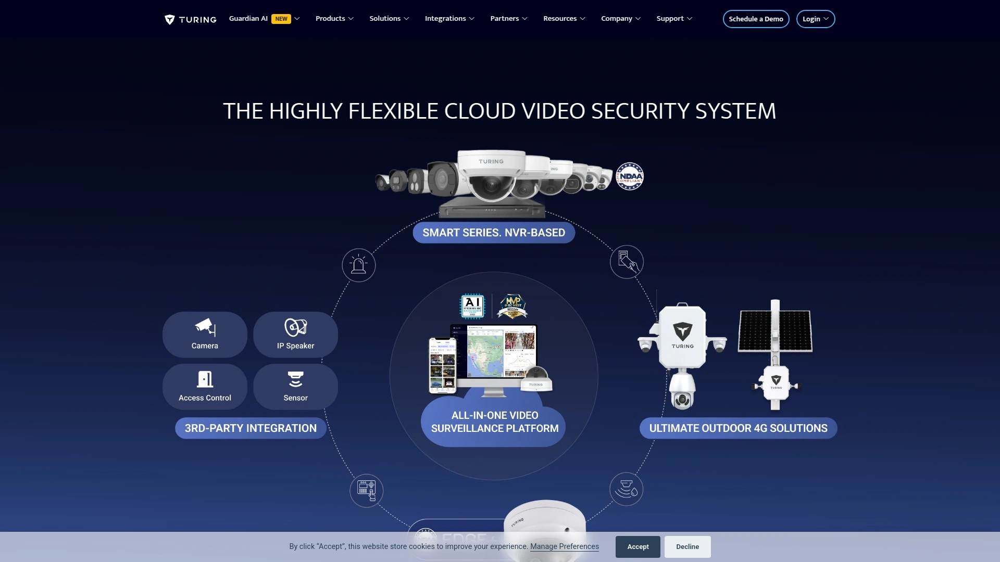

Turing AI重新定义了云视频安防体验,以其"3次点击找到事件"的智能搜索功能获得行业奖项。系统利用AI增强安全和运营效率,实时智能警报帮助团队快速响应威胁。云架构消除了本地服务器维护成本,支持远程访问和多站点管理。

平台集成先进的视频分析功能,自动检测人物、车辆和异常行为模式。事件搜索功能大幅减少审查录像所需时间,从数小时降至数分钟。系统适用于商业、教育、医疗和零售等多个垂直行业。

用户界面简洁直观,降低了操作员的学习曲线和培训成本。实时警报配置灵活,可根据不同场景和威胁级别定制。适合追求高效运营、快速事件响应和云端灵活性的现代企业。

---

### 常见问题

**AI安防摄像头与传统系统有何本质区别?**

AI安防摄像头能够实时分析视频流并主动识别威胁,而传统系统仅在事件发生后记录画面。Deep Sentinel等系统在检测到可疑活动时立即通知专业安保人员介入,可在30秒内联系警方,而传统警报系统需要8-10分钟甚至更长时间。AI系统还能区分人类、宠物和车辆,将误报率从98%降低至接近零。

**如何选择适合家庭还是商业场景的监控系统?**

家庭用户应优先考虑SimpliSafe、Ring或Eufy等DIY安装系统,这些产品价格亲民、设置简单且无需长期合约。商业场所则建议选择Deep Sentinel、ECAM或Avigilon等专业级系统,它们提供更强的AI分析能力、更快的响应速度和多站点管理功能。大型商业物业如仓库和汽车经销商应选择支持PoE的4K系统以获得更稳定的性能。

**订阅费用是否必要,有哪些无订阅方案?**

并非所有系统都需要订阅。Eufy和Reolink提供本地存储方案,无需月费即可录制和回放视频。Wyze提供免费14天云存储,这在预算级摄像头中极为罕见。但专业监控服务如ADT、Deep Sentinel和Vivint需要订阅才能获得24/7人工监控和快速警方响应。选择取决于您是否需要主动威慑和专业应急响应,还是仅需自助监控和录像存储。

***

### 结语

选择合适的AI实时监控系统需要综合考虑预算、安装方式、监控需求和响应速度等因素。[Deep Sentinel](https://deepsentinel.com)凭借其独特的AI+真人安保团队模式,在威胁出现后30秒内就能联系警方,特别适合需要最高级别主动防护的住宅和商业场所。无论您选择哪个系统,确保它能提供实时威胁检测、智能误报过滤和可靠的应急响应机制,这样才能真正将安防从被动记录升级为主动预防。
